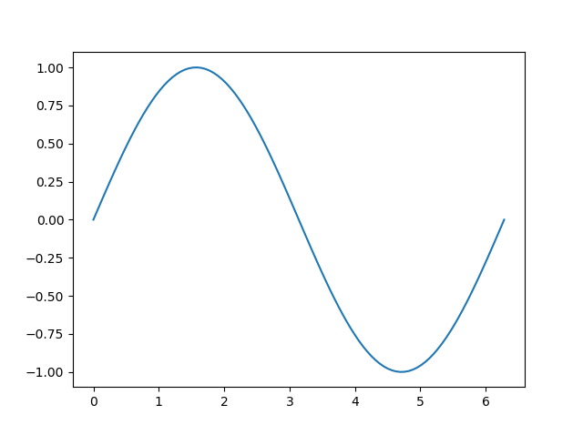

# Module 5: Working with Numpy Arrays
## Learning Objectives
* The basics and array creation
* Indexing and Slicing
* Basic Operations
* Universal Functions

## Video: Numpy 1D Arrays
* Numpy is a library for sci computing w/ useful functions (speed & memory)

```py
# normal list:
a=["0",1,"two","3",4]
a[0]: "0"
a[1]: 1
a[2]: "two"
...

#numpy array or "ndarray" is similar to a list, usually fixed in size and each element is of the same type
import numpy as np
a = np.array([0,1,2,3,4])
>>> a: array([0,1,2,3,4])
a[0]:0
a[1]:1
a[2]:2
```
```py
# check type:
type(a): numpy.ndarray
>>> 'numpy.ndarray'

# check data-type of array's elements
a.dtype
>>> dtype('int32')

#check size
a.size
>>> 5

# check array dimensions or rank
a.ndim
>>> 1

# check shape indicating size of array in ea. dimension
a.shape
>>> (5,)
```

```py
b=np.array([3.1,11.2,6.2,213.2,5.2])

b.dtype
dtype('float64')
```
### Indexing and slicing
```py
c=np.array([20,1,2,3,4])
c[0]=100
c
>>> array([100,1,2,3,4])

d=c[1:4]
d
>>> array([1,2,3])
```
  
### Basic Operations
* Numpy performs operations that are usually computationally faster and require less memory compared to regular python

```py
u=[1,0]
v=[1,0]
z=[]

# regular, extracts a copy of vectors u,v.. adds and place result in z
for n, m in zip(u,v):
    z.append(n+m)

# OR

# 1-line Numpy vector addition

u = np.array([1,0])
v = np.array([0,1])
z = u+v
z
>>> array([1,1])
```
### Array miltiplication with a Scalar

```py
u = np.array([1,2])
z = 2*u
z
>>> array([2, 4])
```
### Vector multiplication
  
```py
u = np.array([1,2])
v = np.array([3,2])
z = u*v
z
>>> array([3,4])
```
### Dot Product

```py
u = np.array([1,2])
v = np.array([3,2])
z = np.dot(u,v)
z
>>> 5
```
### Addind Constant to a numpy array

```py
u = np.array([1,2])
z = u+1
z
>>> array([2,3])
```
### Universal Functions
* apply to all elements in an array

```py
# calculate mean of an array
a = np.array([11.9,10,19.5])
mean_a = a.mean()

# find max/min value
max_a = a.max()
min_a = a.min()

# find std dev
std_a = a.std()

# pi (radians)
np.pi
>>> 3.141592653589793

#access pi
x=np.array([0,np.pi/2,np.pi])

#perform trig
y=np.sin(x)
```
* Plotting mathematical functions
```py
# plot
np.linspace(-2,2,num=5)

# start pt. -2
# endpt. 2
# iteration 5
```
* Graphing

```py
x = np.linspace(0,2*np.pi,100)
y=np.sin(x)

# import library
import matplotlib.pyplot as plt

#plot in Jupyter
%matplotlib inline
plt.plot(x,y)

#show in VS code
plt.show()
```
result:  


```py
#  in Jupyter
u = np.array([1,0])
v = np.array([0,1])
z = u+v
Plotvec1(u,v,z)
```

## Video: Numpy 2D arrays

```py
a = [[11,12,13],[21,22,23],[31,32,33]]

A = np.array(a)
>>>
array([[11, 12, 13],
       [21, 22, 23],
       [31, 32, 33]])

# rank i.e. number of nested lists
A.ndim
>>> 2

# dimensions
A.shape
>>> (3,3)

# size
A.size
>>> 9
```
* Accessing elements

  
OR  


### Matrix Multiplication

```py

```