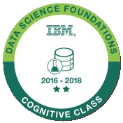

# IBM Certificate (Notes): Python for Data Science
## Certification
* Part of the [IBM Data Science Foundations Badge Level 2](https://www.youracclaim.com/badges/e022257e-50dd-4523-b3c5-f6a4d70ac3ad) - Applied Data Sciece with Python  
  

* [click to verify](https://courses.cognitiveclass.ai/certificates/5e48a35c56f641449c5537b3638de159)
## Overview
* Author: Patrick Dolloso
* Date obtained: Nov 2 2018
* Link: [IBM Certificate in SQL and Relational Databases](#)
* This repository contains notes and projects during my completion of the IBM certification: Python for Data Science
## Skills Obtained:
* Libraries: Numpy, Pandas, Mathprolib
* Data Mining: txt, csv, xlsx mining and cleaning
* Data Visualization
* Cloud Computing: Jupyter Notebooks Deployment
* Functions, Methods, and Scripting
* Mathematics: Matrix manipulation, multi-dimensional algebra
* Data Structures & Datatypes
## Directory
1. [Python Basics](./1-Python-Basics/readme.md)
2. [Data Structures](./2-Data-Structures/readme.md)
3. [Programming Fundamentals](./3-Programming-Fundamentals/readme.md)
4. [Working with Data](./4-Working-with-Data/readme.md)
5. [Numpy Arrays](./5-Numpy-Arrays/readme.md)
6. [Projects](./Projects/readme.md)

## About this course
### Learning Outcomes
* What is Python and why it is useful
* The applications of Python
* How to define variables
* Sets and conditional statements in Python
* The purpose of having functions in Python
* How to operate on files to read and write data in Python
* How to use pandas, a must0have package for anyone attempting data analysis in Python